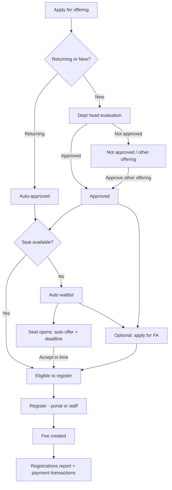

# Program registration pipeline (design)

**Status:** Design agreed (July 2026) — implementation not started.  
**Scope:** Going forward only. Existing enrollments (e.g. QIL) are treated as already past this pipeline.

This document defines apply → evaluate/approve → waitlist/FA (optional) → register → reports, so Registrations and Payment transactions stay distinct.

---

## Goals

1. Separate **application / approval** from **registered enrollment with fees**.
2. New students need evaluation; returning students can register after auto-approval.
3. Capacity: approved applicants go to **waitlist** when full; seat opens → **auto offer with deadline**.
4. Financial assistance is **optional** after approval (including while waitlisted).
5. **Register** creates the course **fee** immediately.
6. Reports: **Registrations** (people + fee/received/balance) and **Payment transactions** (ledger like contact Financial).

---

## Actors and permissions (intent)

| Actor | Can |
|--------|-----|
| Customer (participant / parent) | Apply; answer returning vs new; register when eligible; apply for FA after approval; respond to waitlist offer |
| Staff | Create application on behalf of customer; same actions as customer where allowed |
| Admin | Anything the customer can do, plus staff overrides |
| Department head | Evaluate new applicants; Approve / Not approve; approve into a **different offering** |
| FA committee | Review/approve full or partial scholarship (existing FA module) |

Exact permission keys to map during implementation (`programs.manage`, `applications.*`, department-scoped roles).

---

## Application question: Returning vs New

On apply (customer or staff):

- **Returning student** → application is **auto-approved** for the selected offering → eligible to **register** (or auto waitlist if full).
- **New student** → stays as an **application** only → cannot register until after evaluation and **Approved**.

Self-declared on the form; staff/admin can correct if needed.

---

## Status model (conceptual)

### Application / approval track

Suggested statuses (names can be refined in implementation):

| Status | Meaning |
|--------|---------|
| `submitted` | New-student application awaiting evaluation |
| `approved` | Approved for an offering (returning auto, or DH after eval) |
| `not_approved` | Rejected for the applied offering (comms outside app, or DH re-targets another offering) |
| `withdrawn` | Applicant or staff cancelled |

Optional sub-state for new students: `pending_evaluation` vs `submitted` (same queue for DH).

**Approve into different offering:** DH rejects current offering and approves the same person for another offering in one staff action (or equivalent two-step that ends in `approved` on the new offering).

### Waitlist track (after approval only)

| Status | Meaning |
|--------|---------|
| `waiting` | Approved; offering at capacity |
| `offered` | Seat opened; offer sent with **customizable deadline** (per offering, days) |
| `expired` | Offer deadline passed without register |
| `converted` | Registered from waitlist offer |

Unapproved applicants are **not** on waitlist.

### Registration track

| Status | Meaning |
|--------|---------|
| `registered` / enrolled | Completed register; **fee created**; appears on Registrations report |

Payment progress (paid / partial / pending) stays on the enrollment/charge, not as enrollment lifecycle status.

### Financial assistance (optional)

- Available **after approval**, including while on waitlist.
- Not required to register if they do not need aid.
- After committee awards full/partial aid (or declines / applicant skips), they register when a seat is available (or when offer is accepted).

---

## Happy paths

---

## Screens (intended)

### Customer portal

- Apply to offering (returning/new question).
- See application status (pending eval / approved / not approved).
- If approved and seat available: **Register** (pay / plan / FA already applied).
- If waitlisted: see position / offer countdown; accept offer then register.
- Optional FA application after approval.

### Staff / admin

- Create application for a contact (same fields as customer).
- Act as customer for register / FA / offer response.

### Department workspace

- Queue of **new** applications for department offerings (evaluate → approve / not approve / approve other offering).
- Visibility into approved + waitlist + registered for that department (details may reuse Rosters / offering tabs).

### Offering manage (optional later)

- Offering-level view of applications / waitlist / registered (tabs already stubbed for waitlist elsewhere).

### Programs → Financial Assistance

- Remains home for FA submissions/templates; applicants enter after **approval**.

### Programs → Reports

| Tab | Content |
|-----|---------|
| **Overview** | High-level KPIs / shortcuts |
| **Registrations** | Rename from current Payments label; list of **registered** enrollments: participant, contact, offering, registered date, **Fee**, Received, Balance, payment progress; enrollment lifecycle as needed — **not** transaction Succeeded/Failed/Refunded as the primary Status |
| **Payment transactions** | New tab: org-wide program payment ledger (filter department / offering), same interaction pattern as contact **Financial → Transactions** (Succeeded / Failed / Refunded, refund, receipts, etc.) |

Route note: `/programs/registrations` can remain the Registrations list URL; transactions may be `/programs/reports?tab=transactions` or `/programs/payment-transactions` — decide at implementation.

---

## Data notes (implementation later)

- Prefer explicit **application** entity (or clear enrollment statuses) so “applied / approved” is not confused with “registered with fee”.
- Waitlist rows only for **approved** applicants when capacity is full.
- Fee / charge schedule created **on register**, not on approve.
- Returning vs new stored on the application.
- Migration: no backfill of apply/evaluate for historical rows; mark existing as registered.

SQL and table changes TBD after schema review (`program_enrollments`, `program_waitlist`, applications, charges).

---

## Out of scope for v1 (unless pulled in)

- Building a full messaging module for “not approved” communications (assumed outside app).
- Changing catalog / offering fee setup UX.
- Replacing department Rosters (may later align labels with Registrations).

---

## Implementation order (suggested)

1. Rename Reports tab **Payments → Registrations**; add empty/ stub **Payment transactions** tab wired to real payment rows.
2. Application create (customer + staff) with returning/new; auto-approve returning.
3. Department head approve / not approve / approve other offering.
4. Waitlist on approve-when-full; auto offer + deadline.
5. Gate **Register** on approved + seat or accepted offer; create fee on register.
6. FA entry only after approval; optional path into register.
7. Harden Reports: Registrations = registered only; Transactions = ledger.

---

## Open items for build kickoff

- **Waitlist offer deadline:** customizable per offering (optional program-level default inherited by new offerings). No fixed global day count.
- Exact permission keys for department-head evaluation vs programs.manage.
- Whether “returning” is validated against prior enrollments or trusted as declared (staff can override).
- Catalog capacity: **sum of limited offerings** (see [programs-offering-attributes-migration.md](./programs-offering-attributes-migration.md)).
