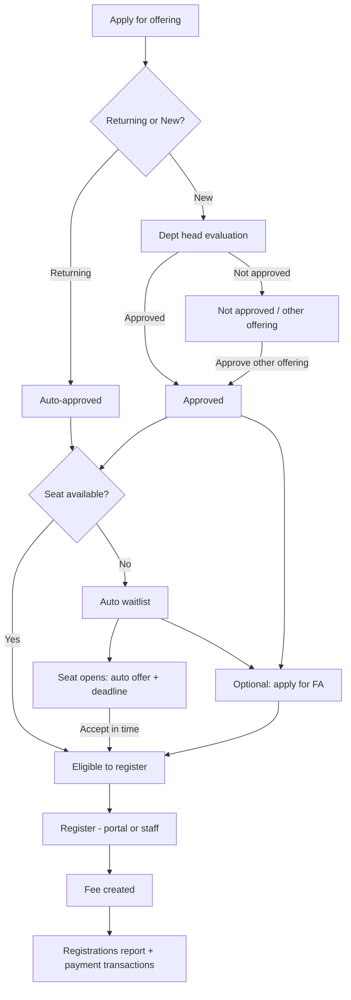

# Program registration pipeline (design)

**Status:** Implementation started (July 2026) — steps 1–3 in progress.  
**Scope:** Going forward only. Existing enrollments (e.g. QIL) are treated as already past this pipeline.

**SQL:** Run `scripts/182_program_registration_applications.sql` after `180`–`181`. Run `scripts/236_program_application_answers.sql` for applicant form answers (`application_answers` JSONB). Run **`scripts/280_program_enrollment_process.sql`** for program enrollment process / seat activation and expanded application statuses.

### Built so far

| Piece | Status |
|--------|--------|
| Reports: **Registrations** rename + **Payment transactions** tab | Done |
| `program_applications` table + waitlist offering/offer columns | Done (SQL `182`) |
| Customer apply (`/customer/programs/[id]/apply`) + application form | Done (full name, returning/new, new-student background, course, babysitter, payment preference → `application_answers`) |
| Enrollment process setting (direct vs application/approval) + seat activation | Done (SQL **`280`**; Settings → Program defaults) |
| Open enrollment (`application_required` synced from program process) | Done (SQL **`194`** / **`280`**) |
| Program workspace **Registrations**: Applications + Enrollments (no Approved tab) | Done |
| Waitlist on full + offer deadline | Not yet (status model ready) |
| Gate Register on approved + seat/offer; fee on register | Done — customer Register requires an unused approved application for that offering; Apply is shown until then |
| FA only after approval | Not yet |

This document defines apply → evaluate/approve → waitlist/FA (optional) → register → reports, so Registrations and Payment transactions stay distinct.

---

## Goals

1. Separate **application / approval** from **registered enrollment with fees**.
2. Everyone applies (new and returning); the department evaluates before registration.
3. Capacity: approved applicants go to **waitlist** when full; seat opens → **auto offer with deadline**.
4. Financial assistance is **optional** after approval (including while waitlisted).
5. **Register** creates the course **fee** immediately.
6. Reports: **Registrations** (people + fee/received/balance) and **Payment transactions** (ledger like contact Financial).

---

## Actors and permissions (intent)

| Actor | Can |
|--------|-----|
| Customer (participant / parent) | Apply; answer returning vs new; register when eligible; apply for FA after approval; respond to waitlist offer |
| Staff | Create application on behalf of customer; same actions as customer where allowed |
| Admin | Anything the customer can do, plus staff overrides |
| Department head | Evaluate new applicants; Approve / Not approve; Withdraw before registration; approve into a **different offering** |
| FA committee | Review/approve full or partial scholarship (existing FA module) |

Exact permission keys to map during implementation (`programs.manage`, `applications.*`, department-scoped roles).

---

## Application form

On apply (customer or staff) and when staff open an application from the department queue:

- **Full name**
- **Returning** or **New** student
- If **New**: previous courses, previous certificates, prior enrolment path (starting from scratch vs moving from another centre + centre name)
- **Course** applying for (from year/season offerings)
- **Babysitter** needed (yes/no)
- **Payment preference** once approved: full payment, two payments (one per semester), or monthly

Structured answers live in `program_applications.application_answers` (JSONB). Staff `evaluation_notes` remain separate.

Self-declared on the form; staff can correct while status is `submitted`.

---

## Status model (conceptual)

### Application / approval track

Suggested statuses (names can be refined in implementation):

| Status | Meaning |
|--------|---------|
| `draft` | Saved, not submitted |
| `submitted` | Evaluation queue (staff review) |
| `evaluation_required` | Evaluation required before approval |
| `evaluation_scheduled` | Evaluation is scheduled |
| `evaluation_completed` | Evaluation recorded; awaiting approval |
| `approved` | Eligible to complete registration (not enrolled) |
| `waitlisted` | Application waitlist (not an enrollment waitlist) |
| `not_approved` / `declined` | Declined |
| `withdrawn` | Applicant or staff cancelled |

**Approve into different offering:** DH rejects current offering and approves the same person for another offering in one staff action (or equivalent two-step that ends in `approved` on the new offering).

Approved without an enrollment is the operational state **Approved — Registration Pending** (calculated, not a stored status).

### Waitlist track (two lists)

Application waitlist (`program_applications.status = waitlisted`) is not the same as enrollment waitlist (`program_waitlist`). Do not combine them.

### Registration track

| Status | Meaning |
|--------|---------|
| `pending` / `pending_payment` | Checkout hold; not on the operational roster |
| `enrolled` / `active` | Seat is active; appears on roster even with a balance |
| `completed` | Term finished |
| `cancelled` / `withdrawn` | Off the default roster |

Payment status is independent (`pending`, `partial`/`balance due`, `paid`, plan, waived, refunded). Capacity counts **active/enrolled** seats, not applications.

### Financial assistance (optional)

- Available **after approval**, including while on waitlist.
- Not required to register if they do not need aid.
- After committee awards full/partial aid (or declines / applicant skips), they register when a seat is available (or when offer is accepted).

---

## Happy paths

---

## Screens (intended)

### Customer portal

- Apply to offering (returning/new question).
- See application status (pending eval / approved / not approved).
- If approved and seat available: **Register** (pay / plan / FA already applied).
- If waitlisted: see position / offer countdown; accept offer then register.
- Optional FA application after approval.

### Staff / admin

- Create application for a contact (same fields as customer).
- Act as customer for register / FA / offer response.

### Department workspace

- Queue of **new** applications for department offerings (evaluate → approve / not approve / withdraw / approve other offering).
- Visibility into approved + waitlist + registered for that department (details may reuse Rosters / offering tabs).

### Offering manage (optional later)

- Offering-level view of applications / waitlist / registered (tabs already stubbed for waitlist elsewhere).

### Programs → Financial Assistance

- Remains home for FA submissions/templates; applicants enter after **approval**.

### Programs → Reports

| Tab | Content |
|-----|---------|
| **Overview** | High-level KPIs / shortcuts |
| **Registrations** | Rename from current Payments label; list of **registered** enrollments: participant, contact, offering, registered date, **Fee**, Received, Balance, payment progress; enrollment lifecycle as needed — **not** transaction Succeeded/Failed/Refunded as the primary Status |
| **Payment transactions** | New tab: org-wide program payment ledger (filter department / offering), same interaction pattern as contact **Financial → Transactions** (Succeeded / Failed / Refunded, refund, receipts, etc.) |

Route note: `/programs/registrations` can remain the Registrations list URL; transactions may be `/programs/reports?tab=transactions` or `/programs/payment-transactions` — decide at implementation.

---

## Data notes

- Table: **`program_applications`** (`scripts/182_program_registration_applications.sql`).
- Waitlist rows only for **approved** applicants when capacity is full (`program_waitlist.offering_id`, `offered_at`, `offer_expires_at`).
- Fee / charge schedule created **on register**, not on approve.
- Returning vs new stored on the application (`applicant_type`).
- Migration: no backfill of apply/evaluate for historical rows; mark existing as registered.

---

## Out of scope for v1 (unless pulled in)

- Building a full messaging module for “not approved” communications (assumed outside app).
- Changing catalog / offering fee setup UX.
- Replacing department Rosters (may later align labels with Registrations).

---

## Implementation order (suggested)

1. Rename Reports tab **Payments → Registrations**; add empty/ stub **Payment transactions** tab wired to real payment rows.
2. Application create (customer + staff) with returning/new; all await evaluation (no auto-approve).
3. Department head approve / not approve / batch approve / approve other offering.
4. Waitlist on approve-when-full; auto offer + deadline.
5. Gate **Register** on approved + seat or accepted offer; create fee on register.
6. FA entry only after approval; optional path into register.
7. Harden Reports: Registrations = registered only; Transactions = ledger.

---

## Open items for build kickoff

- **Waitlist offer deadline:** customizable per offering (optional program-level default inherited by new offerings). No fixed global day count.
- Exact permission keys for department-head evaluation vs programs.manage.
- Whether “returning” is validated against prior enrollments or trusted as declared (staff can override).
- Catalog capacity: **sum of limited offerings** (see [programs-offering-attributes-migration.md](./programs-offering-attributes-migration.md)).
